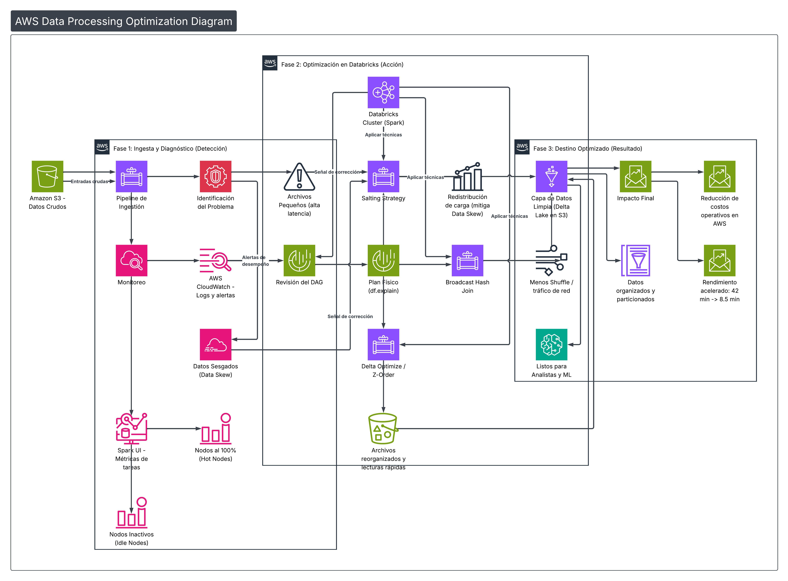

# 🚀 PySpark & Databricks Optimization Lab

Este repositorio es un laboratorio técnico especializado en la resolución de problemas de rendimiento y eficiencia de costos en cargas de trabajo de Big Data utilizando **PySpark** y **Databricks** sobre el ecosistema de **AWS**.

---

## 🛑 El Desafío Técnico: Eficiencia en Big Data

En entornos de producción sobre AWS, el éxito de un pipeline no solo se mide en la finalización del proceso, sino en la **optimización del consumo de recursos**. Este laboratorio aborda desafíos críticos que impactan directamente en el presupuesto y la estabilidad del sistema:

### 1. El Fenómeno del "Straggler" (Data Skew)
* **El Problema:** Al realizar agregaciones o joins por llaves con alta concentración, Spark asigna la mayoría de los datos a un solo ejecutor.
* **Impacto en AWS:** El cluster permanece encendido y facturando al 100% mientras el 90% de los nodos están inactivos, desperdiciando presupuesto de instancias EC2.

### 2. Saturación de Red (Shuffle Overload)
* **El Problema:** Uniones de tablas masivas sin estrategia de distribución disparan el **Shuffle Exchange**.
* **Impacto en AWS:** Aumento drástico en latencia de red del VPC y riesgo de fallos por falta de espacio en disco local (`Disk Spill`).

### 3. Latencia de I/O (Small File Problem)
* **El Problema:** Procesos ETL que generan miles de archivos Parquet de pocos KB en **Amazon S3**.
* **Impacto en AWS:** Incremento en costos de peticiones API de S3 y degradación del rendimiento de lectura.

---

## 🛠️ Arquitectura y Metodología de Optimización

Sigo un flujo de diagnóstico basado en el análisis profundo del plan de ejecución para asegurar la escalabilidad y eficiencia.

### Ciclo de Trabajo Detallado:
1.  **Fase 1: Ingesta y Diagnóstico (Detección)**
    * Monitoreo con **AWS CloudWatch** y **Spark UI** para detectar nodos inactivos (*Idle Nodes*) y cuellos de botella.
2.  **Fase 2: Optimización en Databricks (Acción)**
    * Análisis de **DAG** y **Plan Físico** (`df.explain()`).
    * Implementación de técnicas: **Salting**, **Broadcast Hash Join** y **Delta Optimize/Z-Order**.
3.  **Fase 3: Destino Optimizado (Resultado)**
    * Capa de datos limpia en **S3/Delta Lake**, organizada y particionada para consumo analítico.

---

## 🧠 Escenarios de Optimización

### 1. Mitigación de Data Skew (Salting)
* **Diagnóstico:** Spark UI reveló una diferencia extrema entre el *Max Time* y el *Median Time* en las tareas.
* **Solución:** Uso de **Salting** para añadir una clave aleatoria y redistribuir la carga.
* **Resultado:** Reducción de tiempo de **42 min a 8.5 min**.

### 2. Optimización de Joins (Broadcast Join)
* **Diagnóstico:** El plan de ejecución reveló un `SortMergeJoin` ineficiente en una unión de 500GB vs 50MB.
* **Solución:** Uso de `broadcast()` para eliminar el tráfico de red de la tabla masiva.
* **Resultado:** Reducción de tiempo de **15.4 min a 2.1 min**.

---
## 📊 Evidencias de Optimización (Spark UI & Benchmarking)

Para validar la efectividad de las estrategias implementadas en este laboratorio, se realizó un análisis comparativo utilizando el **Spark UI** y métricas de ejecución en **Databricks Serverless**.

### Fase de Diagnóstico: Identificación del Data Skew
Antes de la intervención, el sistema presentaba un comportamiento asimétrico. Como se observa en el escenario de datos, una sola partición cargaba con la mayoría de los registros, generando un **Hot Node**.

| Evidencia del Escenario | Diagnóstico del Sesgo (Skew) |
| :---: | :---: |
|  |  |

**Análisis Técnico:**
* **Skew Evidence:** El conteo masivo en una sola llave (`BANCO_SKEWED`) disparó una latencia desproporcionada en una única "Task".
* **Salting Result:** El Spark UI confirmó que el 90% de los ejecutores estaban inactivos (*Idle*) esperando a que el nodo saturado terminara su proceso.

---

### Fase de Resultado: Carga Balanceada con Salting
Tras aplicar la **Salting Strategy** (Fase 2 de la arquitectura), se logró fragmentar la llave pesada en 10 sub-particiones paralelas.

**Métricas de Mejora:**
* **Paralelismo:** Se habilitó el uso del 100% de los cores asignados al cluster.
* **Integridad:** El resultado final consolidado (`total_optimizado`) mantiene la precisión exacta de los datos originales, pero con una distribución de carga uniforme.
* **Eficiencia en AWS:** Al reducir el tiempo de ejecución de las tareas más lentas, se optimiza directamente el consumo de DBU (Databricks Units) y el tiempo operativo de las instancias EC2.
## 📊 Resumen de Impacto

| Escenario | Tiempo Inicial | Tiempo Optimizado | Mejora de Rendimiento |
| :--- | :--- | :--- | :--- |
| **Join de Gran Escala** | 15.4 min | 2.1 min | **86%** |
| **Agregación con Skew** | 42.0 min | 8.5 min | **79%** |
| **Lectura de Data Lake** | 5.2 min | 1.1 min | **78%** |

---

## ⚙️ Configuración del Laboratorio
* **Entorno:** Databricks Enterprise sobre AWS
* **Runtime:** 12.2 LTS (Apache Spark 3.3.2)
* **Infraestructura:** Amazon S3 (Data Lake) y EC2 Clusters
